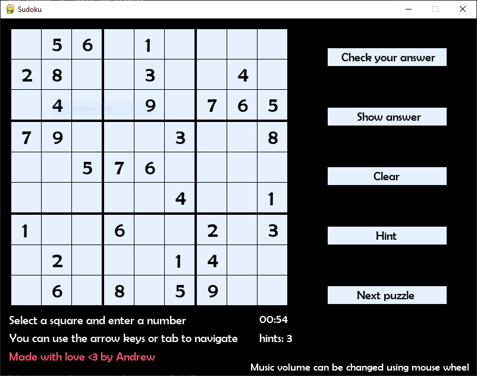
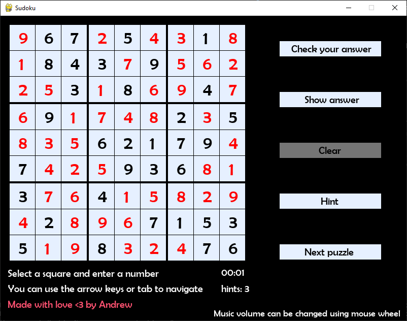

# Sudoku Using Pygame
Simple Sudoku game and solver created with Python and Pygame library.

## Content:
- [Sudoku Using Pygame](#sudoku-using-pygame)
  - [Content:](#content)
  - [General Info:](#general-info)
  - [Technologies:](#technologies)
  - [Running the game:](#running-the-game)
  - [Game Features:](#game-features)
  - [Solving algorithm:](#solving-algorithm)
  - [Puzzles:](#puzzles)
  - [Game images:](#game-images)

## General Info:
Old Sudoku game

9x9 Board with missing numbers and you have to figure out what these numbers are, no number appears twice in row, column or 3x3 subregions of the board

The game has 1000 puzzle to play with and solving algorithm using backtracking 
(keep in mind that the game is semi-working, I am still working on it while learning and in my free time)

Thanks for https://www.kaggle.com/bryanpark/sudoku for providing 1 million puzzle dataset with answers, I just used 1000 puzzle from it.

## Technologies:
To run the game you need:
- Python                    3.6+
- Pygame                    2.0.0

Go to [Running the game](#running-the-game) section to run the game

Other libraries used to create the database: 
- Pandas                    1.1.5

## Running the game:
To run the game you need to install Pygame library using pip:
~~~
$ pip3 install pygame
~~~
After the installation is complete, go to the game folder and run the game from this command:
~~~
$ python3 sudoku.py
~~~

## Game Features:

 * Background music
 * Music volume can be adjusted using the mouse wheel
 * Five buttons for different functionalities:
   - Check player answer for correctness
   - Show puzzle answer
   - Clear board
   - Hint to current cell (shows the correct number for this cell)
   - Load the next puzzle
 * Player can navigate the board using arrows keys or the tab key to get the next empty cell
 * A timer that stops when the player submits the correct answer

## Solving algorithm:
I used iterative backtracking algorithm to solve the puzzle.
You can see the algorithm itself in the puzzleSolver for more details.

tests.py file is for testing the algorithm and comparing the solution that is generated from the algorithm against the provided solution from the dataset.

## Puzzles:
All puzzles are stored in puzzles.db file which is a SQLite database.

I used pandas to read the CSV dataset and extract the puzzles and solutions from it.

Running 'create_database.py' which is in database directory creates a new database file and deletes the old one if it exists

All puzzles must be in string format and the missing numbers are zeros. Example:
~~~
004300209005009001070060043006002087190007400050083000600000105003508690042910300
~~~

## Game images:

